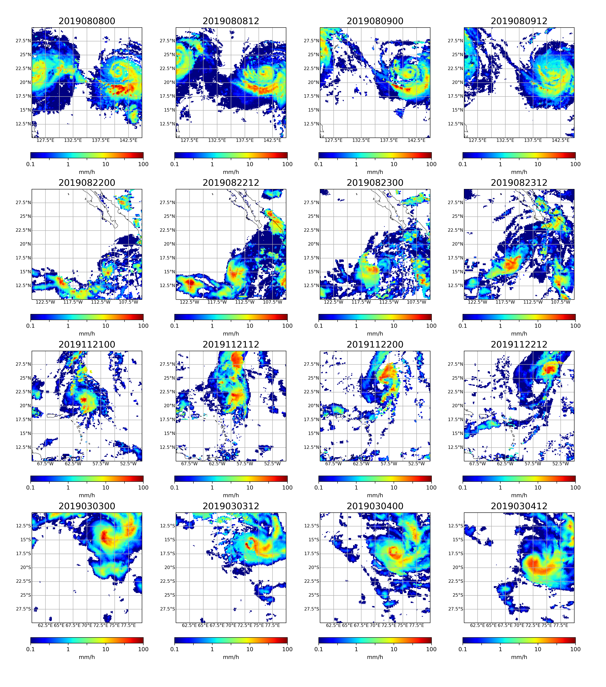

# d-IMERG
d-IMERG: A spatiotemporal benchmark dataset for precipitation forecasting (submitted to CVPR2021)
## d-IMERG
dynamic-IMERG (d-IMERG) is a subset data of IMERG. 

d-IMERG is provided throught following URL.

## IMERG data set
The IMERG products are distributed through several platforms, including the NASA Precipitation Processing System (PPS) and NASA Goddard Earth Sciences (GES) Data and Information Services Center (DISC). Registration is needed when ordering data, and the data are open to users following the data policy of GES DISC. The data are available from 2000 to date with 0.1 degree spatial resolution and 30 min temporal resolution on a global scale. The data format is HDF5, and each file size is 2.8 MB. We collected data of 2019 for the training dataset. The total amount of data is 17,520 per year, and the total volume is 178 GB. The image size for the global region is 3600x1800. 
